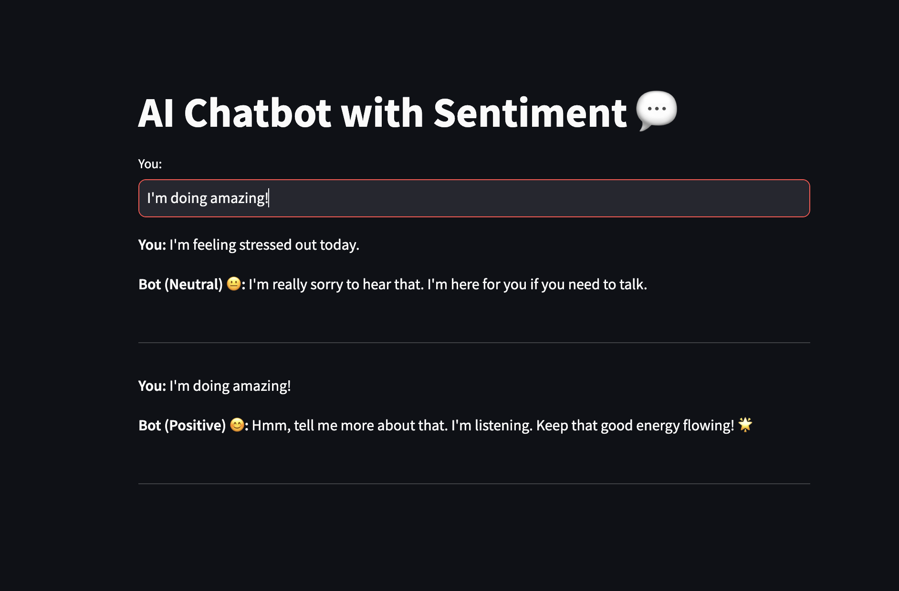

# 🤖 AI Chatbot with Sentiment Analysis

An interactive AI-powered chatbot that detects your emotional tone and responds with empathy. Built using Python, Streamlit, and TextBlob.

 <!-- Optional: Replace with your own -->

---

## 🧠 Features

- 💬 Conversational AI with rule-based intent recognition  
- 🎭 Real-time sentiment analysis (Positive, Negative, Neutral)  
- 🌈 Adaptive tone and emojis based on detected mood  
- 🕒 Full chat history display (like a real-time messenger)  
- 🚀 Built with Streamlit and ready for deployment  

---

## 🛠️ Tech Stack

- **Python**  
- **Streamlit** – for the interactive web UI  
- **TextBlob** – for sentiment analysis  
- **NLTK** – for text processing  
- **Session State** – for managing conversation history  

---

## 📸 Screenshots

> **You:** "I'm feeling stressed out today."  
> **Bot (Neutral 😐):** "I'm really sorry to hear that. I'm here for you if you need to talk."

> **You:** "I'm doing amazing!"  
> **Bot (Positive 😊):** "That's amazing! Always great to hear some positivity 😊 Keep that good energy flowing! 🌟"

---

## 🧪 Run Locally

```bash
git clone https://github.com/your-username/chatbot-sentiment.git
cd chatbot-sentiment
python -m venv venv
source venv/bin/activate  # or venv\Scripts\activate on Windows
pip install -r requirements.txt
streamlit run app.py
```

---

## 📂 Project Structure

```
chatbot-sentiment/
├── app.py              # Main Streamlit app
├── chatbot.py          # Chat logic + tone-based responses
├── sentiment.py        # Sentiment analysis with TextBlob
├── requirements.txt
├── README.md
└── assets/
    └── screenshot.png  # (Optional) App screenshot
```

---

## 📃 License

This project is licensed under the [MIT License](LICENSE).

---

## 👨‍💻 Author

Built with ❤️ by [Mike Anderson](https://github.com/MikeAndersn)
